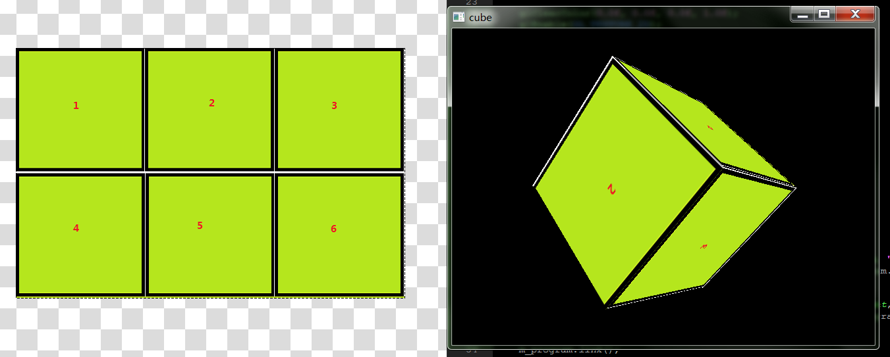
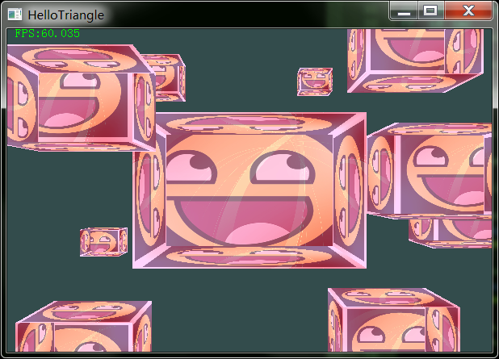
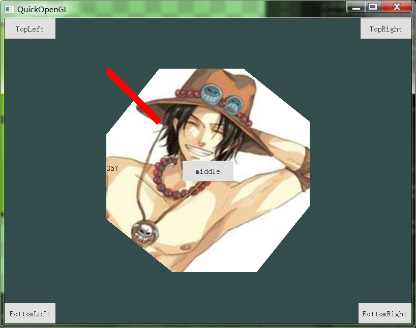
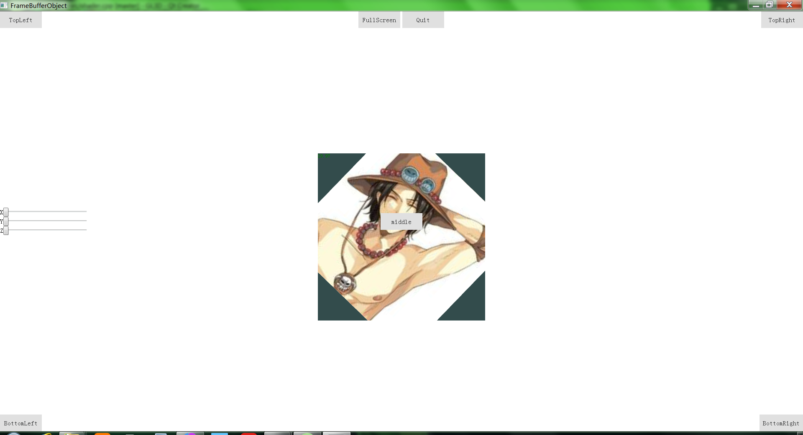
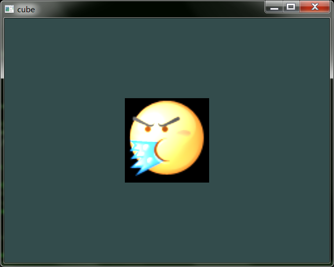
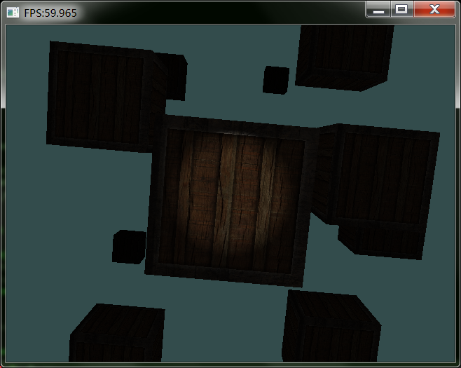
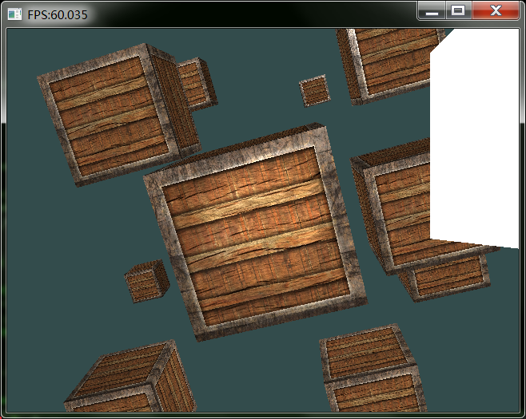
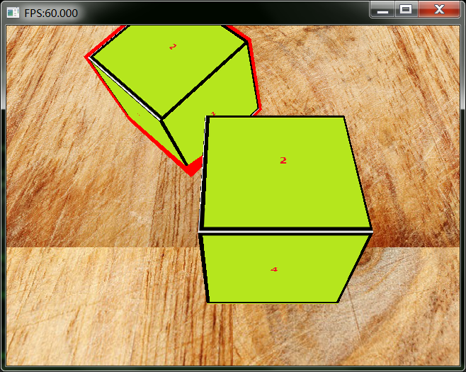
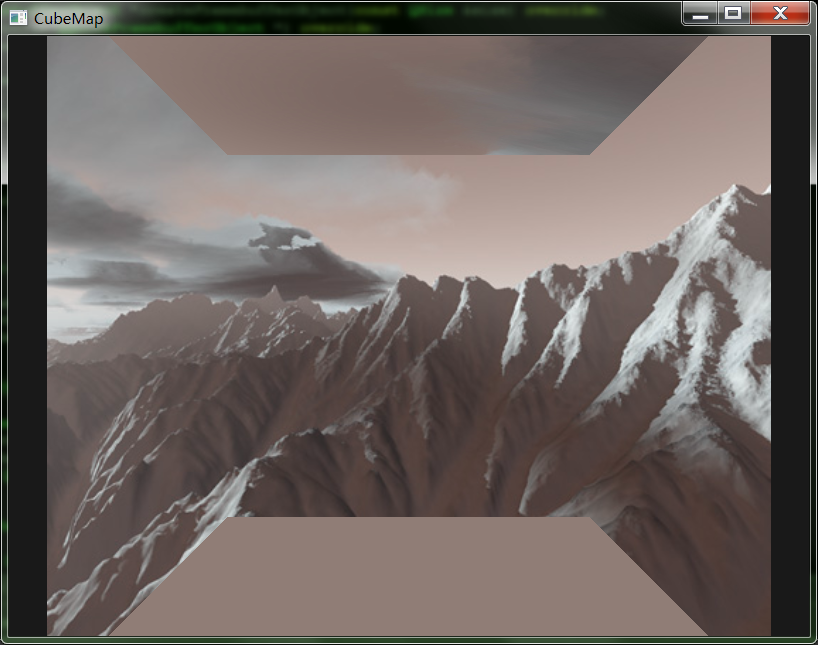

# Qt5 OpenGL

Qt5写的一些OpenGL小例子集合,
参考[LearnOpenGL教程](http://bullteacher.com/category/zh_learnopengl_com)

## License

## 目录

* HelloTexture    

   以QOpenGLWidget为框架，简单的纹理贴图,使用定时器控制纹理旋转。
   

* HelloCube

   立方体贴图的例子，自己用画板画了一个图，然后贴成一个Cube。可以用鼠标控制立方体旋转。
   

* HelloMix   

    绘制了10个立方体，每个立方体的每个表面使用2张纹理混合贴图。混合比例按数字键1/2进行调节。
    

* QuickOpenGL

    这个是在不了解QML Quick内部原理的时候，在qml中添加自定义OpenGL渲染控件，用的是QQuickWindow的beforeRendering信号。后来知道了QQuickFramebufferObject之后，基本上这种方式就被抛弃了。这里保留项目仅作为观赏，建议参考下面FrameBufferObject。
    
* FrameBufferObject

    效果与上一个例子QuickOpenGL 类似，多了全屏放大功能,纹理沿着三个坐标轴旋转的功能。

    使用QQuickFramebufferObject 作为OpenGL自绘制控件(相当于QQuickItem了)。

    QQuickFramebufferObject是 Qt封装好的，需要理解其使用架构。

    这里大概说一下用法：
    1. 继承QQuickFramebufferObject实现一个自定义item,并注册到QML中使用
    2. 继承QQuickFramebufferObject::Renderer,实现一个自定义Renderer
    3. 自定义Renderer内部再封装一个OpenGL相关的渲染类。Renderer是在Scene Graph线程工作，始终拥有OpenGL上下文环境，所以渲染类写在Renderer内部，非常方便。
    4. Renderer 有个函数叫void synchronize(QQuickFramebufferObject *item), 可以用来做线程同步
    (Item工作在主线程，Renderer 工作在Scene Graph绘图线程)
    我用的时候，是把参数item可以强制转换成我从Item派生出来的子类，然后用里面的数据和这个Renderer交互就好了。

* light

    Shader光照的例子。  一个立方体的前面, 放一个移动的光源。
    
* lightCasters

  手电筒光源

    

* mulitLight

  镜面反射、漫反射，手电筒的集合
  

* material

  材质的使用,边缘部分发光，中间部分不发光

  

* DepthTest

  利用深度测试，后面的箱子边缘部分用红色绘制出来

  

* CubeMap

  天空盒 (效果有点问题，后续修改)

  

* SkyBox
 
  重写的天空盒， 可以键盘和鼠标操作

  

### 联系方式:

***

| 作者 | 涛哥                           |
| ---- | -------------------------------- |
|开发理念 | 传承工匠精神 |
| QQ   | 759378563                  |
| 微信 | xsd2410421                       |
| 邮箱 | jared2020@163.com                |
| blog | https://jaredtao.github.io |

***

QQ(TIM)、微信二维码

###### 请放心联系我，乐于提供咨询服务，也可洽谈有偿技术支持相关事宜。

***
#### **打赏**

###### 觉得分享的内容还不错, 就请作者喝杯奶茶吧~~
***
